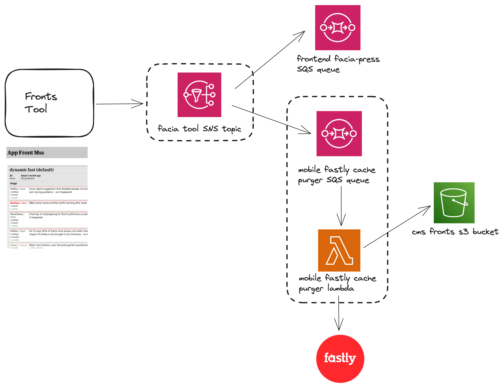

# Mobile Fastly Cache Purger

Fastly is our CDN.

The mobile Fastly cache purger listens for front update messages from the fronts tool and uses the Fastly API to purge the affected collection paths.

This purging enables the updates to the fronts tool to be visible in the app immediately after change, as opposed to the 5 minutes it currently takes for a change to show in apps (the fronts response from MAPI is cached in Fastly with 5 mins TTL).

# Architecture

The mobile Fastly cache purger is an AWS lambda, which sends a purge request to the Fastly API once it's triggered.
The lambda is triggered when a message lands onto the queue, which is subscribed to the SNS topic in the CMS Fronts account.

# Cache purging

Any time there is an update to the fronts tool, the lambda will receive the message sent from the fronts tool (via SNS and SQS). The handler of the `Purger Lambda` will extract the path ID from the message and use the path to look up IDs of all collections within that front using the Config.json file stored in an S3 bucket of the CMS Fronts account.

It will then filter out any draft changes, and send a purge request to the Fastly API for the live changes using the surrogate keys of the extracted collection IDs, purging for both existing and Blueprint collections. 
